# Understanding World Happiness
## Metis Project 2: Webscraping and OLS Regression

Happiness is a hard thing to pin down.  It's both hard to measure and difficult to explain why some people are happier than others.  

The UN endeavors tackle both questions with their annual World Happiness Report (now in it's 5th year), and in this post I'll show how I combined it with some other data to find relationships between a country's characteristics and it's World Happiness Score.


### Introducing the UN's World Happiness Report

The [UN's World Happiness Report](http://worldhappiness.report/) is 'a landmark survey of the state of global happiness'.  It asks individuals from across 155 different countries to: 

*"Think of a ladder, where their best possible life is a 10, and their worst possible life is a 0. They are then asked to rate their own current lives on that 0 to 10 scale."*

Each country's Happiness Score is calculated by taking an average of it's citizen's answers. The report also includes features that score each country on various categories (eg. GDP per capita, Healthy Life Expectancy. See Below).

A complete explanation of the data collected can be found on the Report's website.  The features that I chose to encorporate in my project are defined (by the UN) as:

Feature         | Definition 
---------------|------------
GDP per capita | GDP per capita is in terms of Purchasing Power Parity (PPP) adjusted to constant 2011 international dollars, taken from the World Development Indicators (WDI) released by the World Bank in August 2016. See the appendix for more details. GDP data for 2016 are not yet available, so we extend the GDP time series from 2015 to 2016 using country-specific forecasts of real GDP growth from the OECD Economic Outlook No. 99 (Edition 2016/1) and World Bank’s Global Economic Prospects (Last Updated: 01/06/2016), after adjustment for population growth. The equation uses the natural log of GDP per capita, as this form fits the data significantly better than GDP per capita. | 
Healthy Life Expectancy | The time series of healthy life expectancy at birth are constructed based on data from the World Health Organization (WHO) and WDI. WHO publishes the data on healthy life expectancy for the year 2012. The time series of life expectancies, with no adjustment for health, are available in WDI. We adopt the following strategy to construct the time series of healthy life expectancy at birth: first we generate the ratios of healthy life expectancy to life expectancy in 2012 for countries with both data. We then apply the country-specific ratios to other years to generate the healthy life expectancy data. See the appendix for more details. | 
Social Support | Social support is the national average of the binary responses (either 0 or 1) to the Gallup World Poll (GWP) question “If you were in trouble, do you have relatives or friends you can count on to help you whenever you need them, or not?” | 
Freedom to make life choices | Freedom to make life choices is the national average of binary responses to the GWP question “Are you satisfied or dissatisfied with your freedom to choose what you do with your life?”  | 
Generosity | Generosity is the residual of regressing the national average of GWP responses to the question “Have you donated money to a charity in the past month?” on GDP per capita. | 


### Data Acquisition via Webscraping: 

Our second project at Metis required us to acquire our data by scraping websites using either [Beautiful Soup](https://pypi.python.org/pypi/beautifulsoup4) or [Selenium](http://www.seleniumhq.org/).  I scraped part of the data for my project from Wikipedia, and part from the CIA's World Fact Book.

#### Dataset 1: World Happiness Data


I scraped 2017's World Happiness Report results from [Wikipedia](https://en.wikipedia.org/wiki/World_Happiness_Report) using Beautiful Soup.

This was relatively simple since it was nicely formatted in an html table.  I just read it in with Beautiful Soup, and used pandas to put it straight into a dataframe:

```
wrld_happiness_url = 'https://en.wikipedia.org/wiki/World_Happiness_Report'
response = requests.get(wrld_happiness_url)
page = response.text
soup = BeautifulSoup(page,"lxml")
tables = soup.find_all('table')
happiness_2017 = pd.read_html(str(tables[0]), header = 0, index_col = 0)[0]
```
Easy!

| 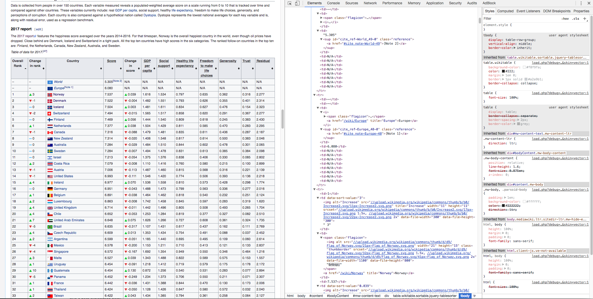 |
|:--:|
|**Figure 1**: Webscraping [World Happiness](https://en.wikipedia.org/wiki/World_Happiness_Report) |

#### Dataset 2: World Facts


[CIA's World FactBook](https://www.cia.gov/library/publications/the-world-factbook/) was a bit more challenging to scrape! 

For the code and functions that I built to scrape this set of data, you can head over to my [GitHub](https://github.com/emilyageller) and read the [Jupyter Notebook](https://github.com/emilyageller/Geller_Metis/blob/master/Project%202/Part%201_Webscraping%20World%20Happiness.ipynb), but I'll give a brief explanation here:

Each of the 155 countries had separate 'Country Fact' pages, so I had to figure out if there was a pattern in their url's so that I could build an automated scraping function.  Luckily there was, and there was also an element on the homepage that contained mappings between each Country's name and id (which was used inside the url for it's page).

Using the country names that I found in the first dataset, I built a function that parsed each country's page.

The next step was finding the features in the page that I wanted! I reviewed the data on offer and (using my intuition) chose about 20.  The html on each of the country fact pages wasn't particularly easy to work with: it was non-heirarchical, which meant it took a bit more finesse to find each element I wanted.  There were also a few cases where features weren't standardized across countries, so that took a bit of wrangling too!

In the end, I scraped the following features for each of the 155 countries:

- Population
- Land Area
- Support Ratio (the ratio between the working population and depends, eg Elderly and Youth)
- Urbanization (Percentage of population living in urban centers)
- Median Mothers' Age at First Birth
- Median Age
- Life Expectancy at Birth
- Fertility Rate (Average number of children per female of childbearing age)
- Hospital Bed Density (# of beds per 1000 people)
- Percentage of Population with Access to Clean Water
- School Life Expectancy (average number of years that individuals attend school)
- GDP
- GDP per capita
- Unemployment Rate
- Percentage of population with Electricity

Definitions for each of these can be found on the CIA's World Fact [Definitions and Notes page](https://www.cia.gov/library/publications/the-world-factbook/docs/notesanddefs.html?fieldkey=2011&term=Geographic%20coordinates).

| 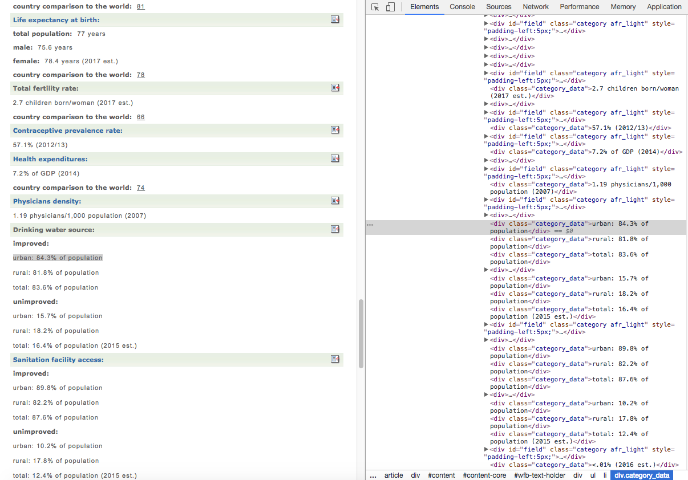 |
|:--:|
|**Figure 2:** Webscraping [World Facts](https://www.cia.gov/library/publications/the-world-factbook/) |

### Data Wrangling

While I was webscraping the two separate datasets, I made sure to clean and format each of the datapoints that I was collecting.  I also directly added each World Facts feature to the World Happiness dataframe, joining based on Country Name.  I could have built two separate dataframes and merged them afterwards, but I decided to streamline it in one step.

There were a few cases where things didnt match up:

Once I had the dataframe all put together, I found that there were some missing (NaN) values.  In most cases I could replace these with the mean for each column. In the case of 'Median Mothers' Age at First Birth', there were 25% missing values! So I had to exlude that feature from my analysis.

I also dropped some features from the dataset that I knew I didn't want to use. These were: Change in Score, Change in rank, url, GDP per capita , Residual and Healthy Life Expectancy.  These were all relative values from the World Happiness dataset, and I wanted to work with the World Facts data instead.

You can get the dataset that I built [here](https://github.com/emilyageller/Geller_Metis/blob/master/Project%202/countries.csv).

### What's in the data?

Before I started building my model, I wanted to do some exploratory data anlaysis to understand the data.

In the below image, you can see the distribution of World Happiness Scores for 2017.  It follows a relatively normal distribution, with a mean around 5.5.  The lowest scoring countries were Burundi (2.91) and Tanzania (3.35), while the highest scoring countries were Norway (7.54) and Denmark (7.52).

| 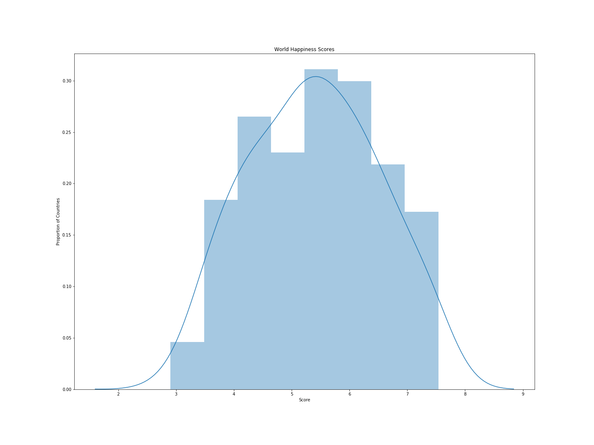 |
|:--:|
| **Figure 2**: 2017 World Happiness Score Distribution|

In order to get good results during my modeling process, I wanted to make sure that my features correlated with my target (Happiness Score).  I discarded features with an absolute correlation less than 0.3.

| 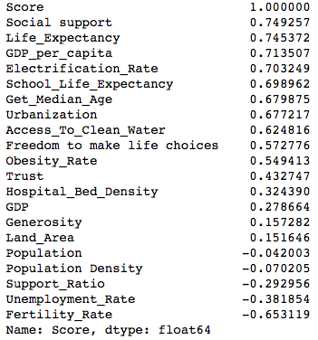 |
|:--:|
|**Figure 3:** Correlations between each feature and the target (Score) |

I ended up getting rid of Population Density, GDP, Land Area, Population and Generosity.  The fact that these features didn't correlate well with Happiness score surprised me! A heatmap of correlations between my remaining features and score is shown in Figure 4. You can see that there are pretty strong relatinships between my remaining features and score.  There are also some strong correlations between each of the features, which tipped me off to be careful of multicollinearity when modeling.

| 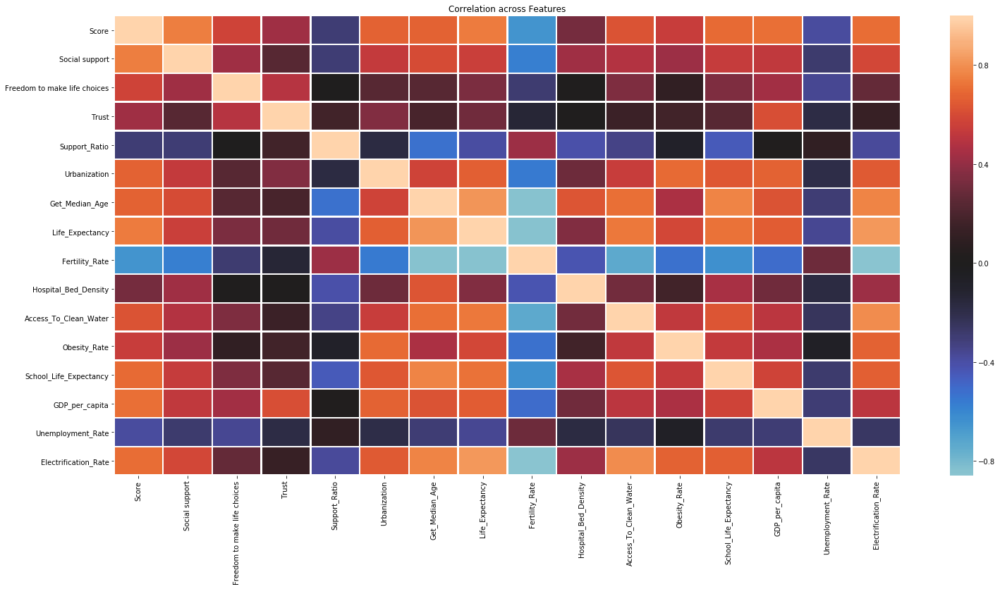|
|:---:|
|**Figure 4**: Correlations across my feature set. Light red corresponds to strong positive correlation, light blue to strong negative correlation, and darker colors denote weaker correlations.|

To dive a bit deeper, I plotted each feature against each other to get a feeling for the different relationships within my dataset.

One relationship that stuck out to me was that between GDP per capita and all of the other features. See Figure 6a. It has a positively skewed distribution, so a log transform looked like it could be in order!

| 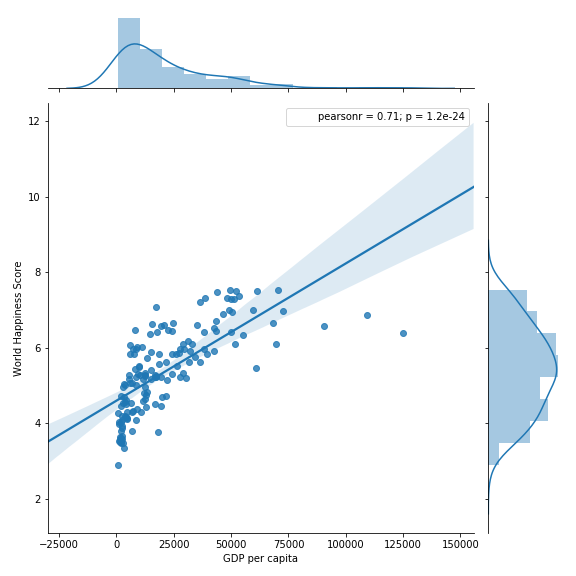 | 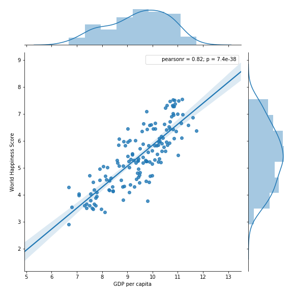 |
|:--:|:--:|
|**Figure 6a:** GDP per Capita | **Figure 6b:** Logarithmically Transformed GDP per Capita |

By taking the log transform of GDP per capita, I was able to produce a much more linear relationship between GDP per capita and World Happiness Score.

The other features looked mostly ok, though if I have time in the future, I'd like to explore some more transformations!

Having paired down my features, I was ready to start modeling!

### Modeling Process

In this project, we were exploring OLS Regression using StatsModels and SciKitLearn. 

Having looked at a few features modeled against score already, I started by trying a model with all of my features.  It came out with an r-squared of 0.828 and a mean squared error of 0.214, which was great! Unfortunately, the pvalues for some of the features were less than ideal.  High pvalues indicate that the relationship between that feature and the score is not statistically significant.

I played around with different combinations, but in general the following features had high pvalues:

- Trust, 
- Support Ratio, 
- Urbanization, 
- Get Median Age, 
- Fertility Rate, 
- Hospital Bed Density, 
- Access to clean water,
- Obesity Rate,
- Unemployment Rate and,
- Electrification Rate.

The features whose statistical significance that I was comfortable with were:

- Social support,
- Freedom to make life choices,
- Life expectancy,
- School life expectancy and
- Log transform of GDP per capita.

The StatsModel Summary for this final set of features is shown in Figure 7.

| 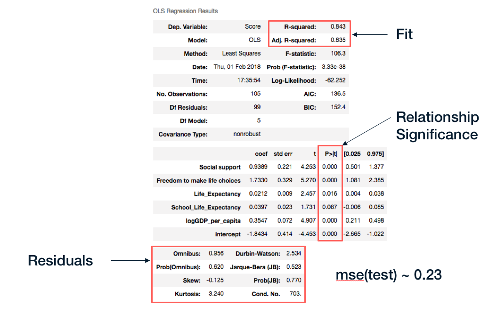 |
|:--:|
|**Figure 7:** OLS Regression Summary for my final feature set|

The r-squared increased to 0.84, meaning my model could account for 84% variance in the Score! Pvalues for the Omnibus and Jarque-Bera indicate that the residuals follow a normal distribution, and the mean squared error looked pretty good too! 

Under a train/test split ratio of 0.3, a 10-Fold Cross Validation showed the r-squared (eg my model's accuracy) to drop to around 0.75.  This was expected, but my next step was to see if I could improve it using regularization!

### Tweaking the Model with Regularization

It's important to consider regularization when modeling with Linear Regression, because it can improve your model's accuracy when predicting on out of sample data.  

I used SciKitLearn's RidgeCV, LassoCV and ElasticNetCV to try out different approaches to regularize my model.  RidgeCV returned the best results, with the optimum alpha at 0.001, and corresponding r-squared and mean squared error at 0.766 and 0.279 respectively.

I was pretty happy with that!

### Visualizing the model

Now that I had my model, I wanted to see what it looked like!

One way to see how my model performed was to plot the actual scores against my model's predictions.  The more accurate the model, the more it will converge to y = x.  

Another way to view the model is to look at the residuals for each prediction.  Ideally they'll look normally (randomly) distributed, meaning the model has extracted most of the variance in the data.

| 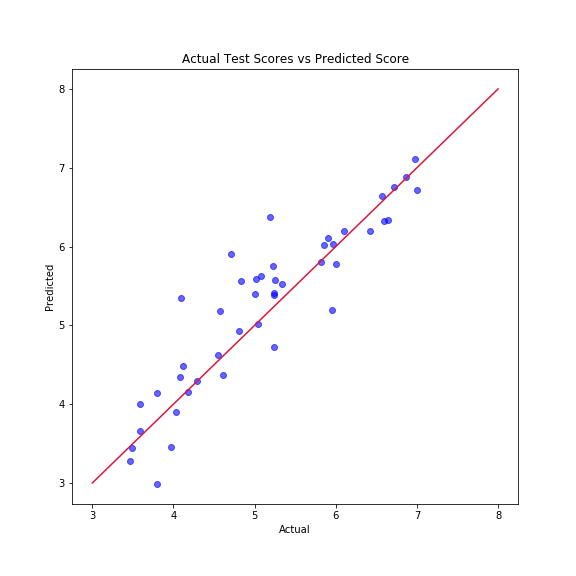 | 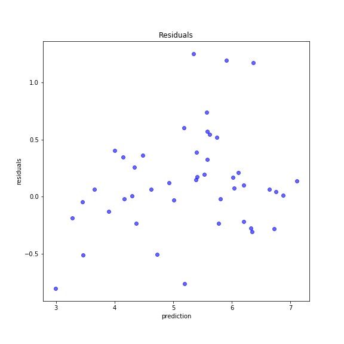
|:--:|:--:|
|**Figure 8a:** Actual scores vs Model's predictions | **Figure 8b**: Residuals for each prediction |

Figures 8a and 8b suggest that the model is accounting for quite a bit of the variance in the data, though there do appear to be some areas that could be improved further! (eg. outliers and some signs of autocorrelation)  

One more way to see how the model performs is to plot the actual scores and predictions against each of the features.  See Figure 9.

|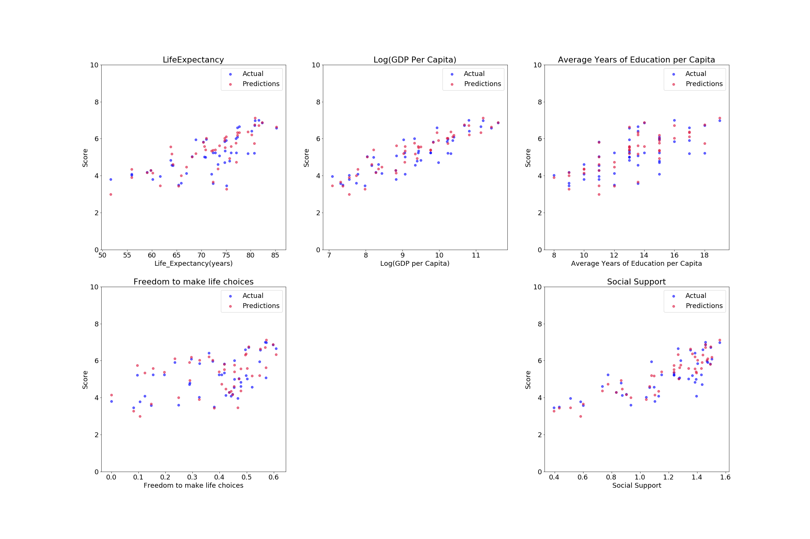|
|:--:|
|**Figure 9:** How the model's predictions compare to the actual results for each feature.  Blue dots indicate actual results, and red dots indicate predictions.|

Looks pretty good, though there's always room for improvement!


### What does it all mean?!

All the stats are great, but what does this model actually tell us?!

It tells us that (from the data I collected) there's a positive statistically significant relationship between 5 of the features that I collected and a country's Happiness Score.  See Figure 10.

|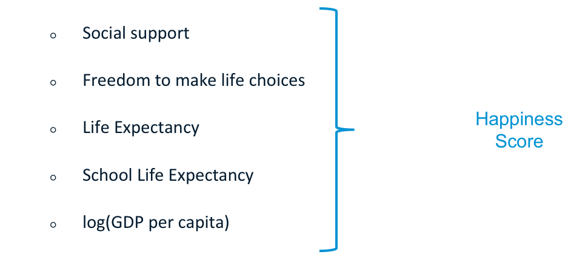 |
|:--:|
|**Figure 10**: The most statistically significant relationship the model found between the original set of features and the Happiness Score |

This is actually pretty meaningful!

It means that having a strong community in which individuals feel free to do as they please is **really** important when considering a population's happiness.  It also indicates that good health care and education systems are also key, as well as a higher GDP per capita.

These insights line up with those made in the UN's Report, and should support policymakers' decisions in the future.

--

I loved working with this data to capture such meaningful results.  I look forward to improving the model and considering other features once I've completed my bootcamp!

I presented this project to an audience at Metis using a deck that can be found [here](https://github.com/emilyageller/Geller_Metis/blob/master/Project%202/Project2-World%20Happiness.pptx).
